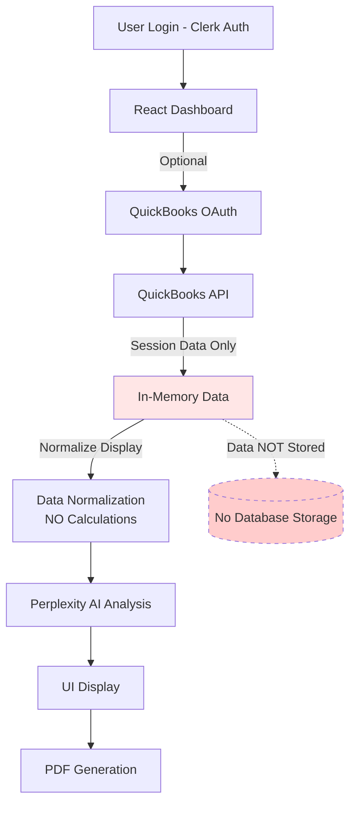

# QuickBooks Analyzer - Architecture Overview

## System Architecture

The QuickBooks Analyzer is a comprehensive financial analysis platform that integrates QuickBooks Online data with AI-powered insights. This document provides an overview of the complete data flow and system architecture.

## Data Flow Architecture (Stateless System)



**CRITICAL: System is STATELESS**
- No financial data stored in database
- Data exists only during active session
- Each session fetches fresh data from QuickBooks

## Component Architecture

### 1. Data Collection Layer

**QuickBooks API Integration**
- OAuth 2.0 authentication flow
- Fetches multiple report types:
  - Profit & Loss Statement
  - Balance Sheet
  - Cash Flow Statement
  - AP/AR Aging Reports
  - Budget vs. Actual (when available)

### 2. Data Normalization Layer (Display Only)

**Normalized Structure (NO Calculations)**
```json
{
  "metadata": {
    "companyId": "string",
    "companyName": "string",
    "reportPeriod": { "startDate": "date", "endDate": "date" },
    "currency": "USD"
  },
  // Direct QBO data - NO computed values
  "profitAndLoss": {
    // As received from QuickBooks API
    "rawData": "QBO Response Structure"
  },
  "balanceSheet": {
    // As received from QuickBooks API
    "rawData": "QBO Response Structure"
  },
  "cashFlow": {
    // As received from QuickBooks API
    "rawData": "QBO Response Structure"
  },
  // NO calculated metrics
  // NO derived ratios
  // NO trend analysis
}
```

**IMPORTANT**: System performs NO calculations on financial data. All computations remain in QuickBooks or are performed by the AI during analysis.

### 3. AI Analysis Layer

**Perplexity LLM Integration**
- Receives unified financial data as JSON
- Generates comprehensive analysis including:
  1. Executive Summary (3-5 key takeaways)
  2. Financial Performance Snapshot
  3. Cash Flow Analysis
  4. Revenue Metrics
  5. Expense Review
  6. KPI Dashboard
  7. Working Capital & Liquidity
  8. Year-over-Year Analysis
  9. Budget vs. Actual
  10. Forward Outlook

**LLM Response Structure**
```json
{
  "choices": [{
    "message": {
      "content": {
        "executiveSummary": {},
        "financialSnapshot": {},
        "cashFlowAnalysis": {},
        "revenueMetrics": {},
        "expenseReview": {},
        "kpiDashboard": {},
        "workingCapital": {},
        "yearOverYear": {},
        "budgetVsActual": {},
        "forwardOutlook": {}
      }
    }
  }]
}
```

### 4. Presentation Layer

**UI Components**
- React 18 with TypeScript
- Component-based architecture using Radix UI
- Real-time data visualization with Recharts
- Responsive design with Tailwind CSS

**PDF Generation**
- Client-side generation using jsPDF
- Converts parsed LLM response to PDF format
- Includes charts, tables, and formatted text
- Returns application/pdf blob for download

## Technology Stack

### Frontend
- **Framework**: React 18 with TypeScript
- **Build Tool**: Vite
- **UI Components**: Radix UI + Tailwind CSS
- **Charts**: Recharts
- **PDF**: jsPDF + html2canvas
- **Routing**: React Router
- **State Management**: React Hooks

### Backend Services
- **Database**: Supabase (PostgreSQL with RLS)
- **Authentication**: Clerk
- **API Integration**: Express.js server
- **Deployment**: Netlify with API proxies

### External APIs
- **Financial Data**: QuickBooks Online API
- **AI Analysis**: Perplexity Pro LLM (pplx-70b-online)
- **OAuth Provider**: Intuit OAuth 2.0

## Security Architecture

### Multi-Layer Security
1. **Authentication**: Clerk with OAuth/SSO
2. **Authorization**: RPC functions with SECURITY DEFINER
3. **Data Protection**: No financial data stored (stateless)
4. **Token Management**: Encrypted OAuth tokens only
5. **CORS Protection**: Netlify API proxies
6. **Input Validation**: Schema validation at all layers

### RPC-Based Security Model
- All database access through RPC functions
- SECURITY DEFINER bypasses JWT validation issues
- Clerk user IDs passed directly to RPC functions
- Single-admin constraint enforced at database level

## Data Storage

### PostgreSQL Schema (Minimal Storage)
```sql
-- Only store authentication and connection data
CREATE TABLE users (
  clerk_id TEXT PRIMARY KEY,
  email TEXT,
  created_at TIMESTAMPTZ DEFAULT NOW()
);

CREATE TABLE quickbooks_connections (
  id UUID PRIMARY KEY DEFAULT gen_random_uuid(),
  user_id TEXT REFERENCES users(clerk_id),
  company_id TEXT UNIQUE,
  admin_email TEXT,
  connected_at TIMESTAMPTZ DEFAULT NOW(),
  CONSTRAINT one_admin_per_company UNIQUE (company_id)
);

-- NO financial_reports table
-- NO raw_data storage
-- NO metrics storage
-- System is STATELESS - data exists only in session
```

## Implementation Services

### Core Services

1. **QBOService** - Handles QuickBooks API integration (OAuth only)
2. **DataTransformService** - Normalizes data for display (NO calculations)
3. **PerplexityService** - Manages LLM interactions (AI performs analysis)
4. **PDFService** - Generates PDF reports (session data only)
5. **ReportOrchestrator** - Coordinates the stateless flow

### Service Interaction Flow

```typescript
// Stateless flow - NO data persistence
async function generateFinancialReport(companyId: string) {
  // 1. Fetch data from QuickBooks (not stored)
  const qboData = await QBOService.fetchAllReports(companyId);
  
  // 2. Normalize for display (NO calculations)
  const normalizedData = DataTransformService.normalizeForDisplay(qboData);
  
  // 3. AI performs ALL analysis and calculations
  const aiAnalysis = await PerplexityService.analyze(normalizedData);
  
  // 4. Parse for UI display (session only)
  const uiSections = DataTransformService.parseLLMResponse(aiAnalysis);
  
  // 5. Generate PDF if requested (not stored)
  const pdfBlob = await PDFService.generate(uiSections);
  
  // Data expires when session ends
  return { uiSections, pdfBlob };
}
```

## Deployment Architecture

### Infrastructure
- **Frontend Hosting**: Netlify CDN
- **Database**: Supabase managed PostgreSQL
- **Authentication**: Clerk cloud service
- **API Server**: Node.js on separate infrastructure

### Environment Configuration
- Development, Staging, Production environments
- Environment-specific API keys and endpoints
- Feature flags for gradual rollouts

## Performance Considerations

### Optimization Strategies
1. **Lazy Loading**: Components loaded on demand
2. **No Caching**: Fresh data fetched each session (stateless)
3. **CDN Distribution**: Static assets via Netlify
4. **Minimal Database**: Only auth/connection data stored
5. **Session Management**: Data cleared after session ends

### Scalability
- Horizontal scaling via Netlify's infrastructure
- Database connection pooling
- Async processing for heavy operations
- Rate limiting on API endpoints

## Monitoring & Observability

### Key Metrics
- API response times
- LLM processing duration
- PDF generation performance
- User session analytics
- Error rates and types

### Logging Strategy
- Structured logging with correlation IDs
- Audit trail for all financial data access
- Error tracking with Sentry
- Performance monitoring with DataDog

## Future Enhancements

### Planned Features
1. Real-time collaboration on reports
2. Custom report templates
3. Automated report scheduling
4. Mobile application
5. Advanced ML-based forecasting
6. Multi-currency support
7. Industry benchmarking
8. Excel export functionality

### Architecture Evolution
- Microservices for better scalability
- GraphQL API layer
- Event-driven architecture
- Real-time WebSocket updates
- Kubernetes deployment

## References

For detailed architectural decisions, see the [Architecture Decision Records](./adr/README.md).

## Contact

For questions about the architecture, please refer to the development team or create an issue in the project repository.