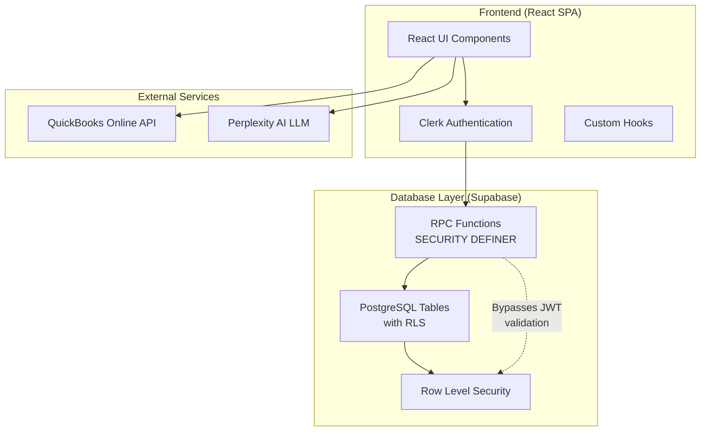
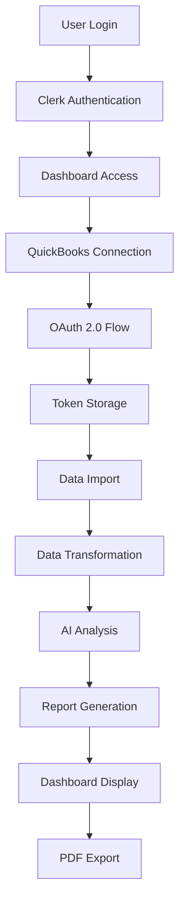

# Technical Onboarding Document - QuickBooks Analyzer Platform

## Table of Contents
1. [Executive Summary](#executive-summary)
2. [System Architecture Overview](#system-architecture-overview)
3. [Functional Logical Flow](#functional-logical-flow)
4. [Implementation Specifications](#implementation-specifications)
5. [Tools and Technologies](#tools-and-technologies)
6. [Development Environment Setup](#development-environment-setup)
7. [Testing Strategy](#testing-strategy)
8. [Deployment Process](#deployment-process)
9. [Security Considerations](#security-considerations)
10. [Monitoring and Maintenance](#monitoring-and-maintenance)

---

## 1. Executive Summary

### Project Overview
QuickBooks Analyzer is an AI-powered financial analysis platform that transforms raw QuickBooks data into comprehensive, actionable financial insights. The platform automates the generation of professional financial reports, reducing manual report preparation time by 90%.

### Business Value
- **Automated Analysis**: Convert QuickBooks data into professional reports in minutes
- **AI-Powered Insights**: Leverage Perplexity AI for intelligent financial analysis
- **Industry Benchmarking**: Compare performance against industry standards
- **Real-time Updates**: Live synchronization with QuickBooks data
- **Professional Output**: Generate board-ready PDF and Excel reports

### Target Users
- Small to medium-sized businesses
- Financial analysts and consultants
- Accounting firms
- CFOs and financial decision-makers

### Key Capabilities
1. **QuickBooks Integration**: Secure OAuth 2.0 connection with automatic data sync
2. **Comprehensive Analysis**: P&L, Balance Sheet, Cash Flow, and aging report analysis
3. **AI Insights**: Perplexity-powered narrative analysis and recommendations
4. **Professional Reports**: Automated PDF/Excel generation with charts and KPIs
5. **Multi-tenant Architecture**: Secure, isolated data for each organization

---

## 2. System Architecture Overview

### High-Level Architecture



**Key Architectural Decisions:**
- **Frontend-Only Architecture**: No backend server required
- **Stateless System**: No QBO data stored between sessions
- **RPC Functions**: All database access through SECURITY DEFINER functions
- **Single Admin Constraint**: Enforced at database level
- **Optional QuickBooks**: QBO connection not required for app access

### Component Architecture

```
src/
├── components/           # UI Components
│   ├── auth/            # Authentication components
│   ├── dashboard/       # Dashboard UI
│   ├── quickbooks/      # QBO integration UI
│   ├── reports/         # Report generation UI
│   └── ui/              # Reusable UI components
├── services/            # Business Logic Layer
│   ├── quickbooks.ts    # QBO API integration
│   ├── dataTransform.ts # Data normalization
│   ├── perplexity.ts    # AI analysis
│   ├── pdfEnhanced.ts   # PDF generation
│   └── reportOrchestrator.ts # Workflow coordination
├── hooks/               # React Custom Hooks
│   └── useQuickBooks.ts # QBO connection hook
├── config/              # Configuration
│   ├── clerk.ts         # Auth config
│   └── quickbooks.ts    # QBO config
└── types/               # TypeScript Definitions
```

---

## 3. Functional Logical Flow

### Complete Data Pipeline Flow



### Stage 1: User Authentication & Authorization

**What Happens:**
1. User accesses the application
2. Redirected to Clerk authentication
3. Google OAuth login flow
4. JWT token generation
5. User profile synchronization with Supabase

**Tools/Implementation Needed:**
- **Clerk SDK**: `@clerk/clerk-react`
- **Configuration**: `VITE_CLERK_PUBLISHABLE_KEY`
- **Components**: `AuthWrapper.tsx`, `SignInPage.tsx`
- **Supabase Sync**: `supabase-clerk.ts`

**Specifications:**
```typescript
// Authentication Flow
interface AuthFlow {
  provider: 'google';
  sessionToken: string;
  userId: string;
  organizationId?: string;
}

// User sync with Supabase
async function syncUserToSupabase(clerkUser: ClerkUser) {
  const { data, error } = await supabase
    .from('users')
    .upsert({
      id: clerkUser.id,
      email: clerkUser.emailAddresses[0].emailAddress,
      name: clerkUser.fullName,
      updated_at: new Date().toISOString()
    });
}
```

### Stage 2: QuickBooks Connection (OAuth 2.0)

**What Happens:**
1. User initiates QBO connection
2. OAuth 2.0 authorization request
3. User authorizes on QuickBooks
4. Callback with authorization code
5. Token exchange and storage

**Tools/Implementation Needed:**
- **QuickBooks SDK**: `intuit-oauth`
- **Express Endpoints**: `/api/quickbooks/token`
- **Component**: `QuickBooksConnection.tsx`
- **Token Manager**: `QBOTokenManager.tsx`

**Specifications:**
```typescript
// OAuth Configuration
interface QBOAuthConfig {
  clientId: string;
  clientSecret: string;
  redirectUri: string;
  environment: 'sandbox' | 'production';
  scopes: ['com.intuit.quickbooks.accounting'];
}

// Token Storage
interface QBOToken {
  accessToken: string;
  refreshToken: string;
  expiresAt: Date;
  realmId: string;
  companyName: string;
}
```

### Stage 3: Data Import from QuickBooks (Session-Only)

**What Happens:**
1. Authenticated API calls to QBO
2. Fetch P&L Statement
3. Fetch Balance Sheet
4. Fetch Cash Flow Statement
5. Fetch Aging Reports (AR/AP)
6. **Data held in memory during session only**

**IMPORTANT: System is STATELESS/MEMORYLESS**
- No QBO financial data is ever stored in database
- Data exists only during the active session
- Each report generation fetches fresh data from QBO
- No historical data retention

**Tools/Implementation Needed:**
- **API Endpoints**: QuickBooks Reports API
- **Service**: `quickbooks.service.ts`
- **Database Tables**: `financial_reports`, `raw_qbo_data`

**Specifications:**
```typescript
// Report Import
interface ReportImport {
  reportType: 'ProfitAndLoss' | 'BalanceSheet' | 'CashFlow' | 'AgingSummary';
  dateRange: {
    startDate: string;
    endDate: string;
  };
  summarizeBy?: 'Month' | 'Quarter' | 'Year';
}

// API Call Example
async function importProfitAndLoss(companyId: string, dateRange: DateRange) {
  const response = await qboClient.get(
    `/v3/company/${companyId}/reports/ProfitAndLoss`,
    {
      params: {
        start_date: dateRange.startDate,
        end_date: dateRange.endDate,
        summarize_column_by: 'Month'
      }
    }
  );
  return response.data;
}
```

### Stage 4: Data Normalization (Display Only)

**What Happens:**
1. Parse QBO JSON responses
2. Normalize data structure for UI display
3. **NO calculations or computations performed**
4. **NO metrics or KPIs generated**
5. Prepare normalized structure for AI analysis

**IMPORTANT: NO CALCULATIONS**
- System only normalizes QBO data for viewing
- All financial calculations remain in QBO
- No derived metrics or ratios computed
- Raw data passed to AI for analysis

**Tools/Implementation Needed:**
- **Service**: `dataTransform.service.ts`
- **Purpose**: Data normalization only (no calculations)
- **Output Format**: Unified JSON structure for display

**Specifications:**
```typescript
// Normalized Data Structure (Display Only)
interface NormalizedFinancialData {
  companyInfo: {
    name: string;
    realmId: string;
    reportPeriod: string;
  };
  // Direct mapping from QBO responses
  reports: {
    profitAndLoss: QBOReportData;    // As-is from QBO
    balanceSheet: QBOReportData;     // As-is from QBO
    cashFlow: QBOReportData;         // As-is from QBO
    agingReports: QBOReportData;     // As-is from QBO
  };
  // NO calculated metrics
  // NO derived ratios
  // NO trend analysis
}
```

### Stage 5: AI-Powered Analysis (Perplexity)

**What Happens:**
1. Construct analysis prompt
2. Send to Perplexity API
3. Receive AI-generated insights
4. Parse response sections
5. Validate and structure output

**Tools/Implementation Needed:**
- **API**: Perplexity Pro (pplx-70b-online)
- **Service**: `perplexityEnhanced.service.ts`
- **Prompt Templates**: Industry-specific analysis

**Specifications:**
```typescript
// AI Analysis Request
interface AIAnalysisRequest {
  financialData: TransformedFinancialData;
  analysisType: 'comprehensive' | 'executive' | 'scenario';
  industryContext: string;
  customPrompt?: string;
}

// Perplexity API Call
async function analyzeFinancials(data: TransformedFinancialData) {
  const systemPrompt = `You are a senior financial analyst...`;
  const userPrompt = `Analyze the following financial data: ${JSON.stringify(data)}`;
  
  const response = await perplexityClient.post('/chat/completions', {
    model: 'pplx-70b-online',
    messages: [
      { role: 'system', content: systemPrompt },
      { role: 'user', content: userPrompt }
    ],
    temperature: 0.2,
    max_tokens: 4000
  });
  
  return parseAIResponse(response.data);
}
```

### Stage 6: Report Generation (PDF/Excel)

**What Happens:**
1. Compile analysis sections
2. Generate charts and graphs
3. Format professional layout
4. Create PDF document
5. Store in Supabase storage

**Tools/Implementation Needed:**
- **Libraries**: `jsPDF`, `recharts`
- **Service**: `pdfEnhanced.service.ts`
- **Templates**: Report layouts

**Specifications:**
```typescript
// PDF Generation
interface ReportGeneration {
  sections: {
    executiveSummary: string;
    financialAnalysis: AnalysisSection[];
    charts: ChartData[];
    recommendations: string[];
  };
  format: {
    template: 'professional' | 'detailed' | 'summary';
    includeCharts: boolean;
    includeAppendix: boolean;
  };
}

// PDF Creation
function generatePDF(report: ProcessedReport) {
  const pdf = new jsPDF();
  
  // Add header
  pdf.setFontSize(20);
  pdf.text('Financial Analysis Report', 20, 20);
  
  // Add sections
  report.sections.forEach((section, index) => {
    pdf.addPage();
    pdf.setFontSize(16);
    pdf.text(section.title, 20, 20);
    pdf.setFontSize(12);
    pdf.text(section.content, 20, 40, { maxWidth: 170 });
  });
  
  return pdf.output('blob');
}
```

### Stage 7: Dashboard Presentation

**What Happens:**
1. Display key metrics
2. Render interactive charts
3. Show analysis summaries
4. Enable report downloads
5. Real-time updates

**Tools/Implementation Needed:**
- **Components**: `DashboardStats.tsx`, `FinancialChart.tsx`
- **State Management**: React hooks
- **Real-time**: Supabase subscriptions

**Specifications:**
```typescript
// Dashboard Data
interface DashboardData {
  metrics: {
    revenue: MetricCard;
    profit: MetricCard;
    cashFlow: MetricCard;
    expenses: MetricCard;
  };
  charts: {
    revenueChart: ChartConfig;
    expenseBreakdown: ChartConfig;
    cashFlowTrend: ChartConfig;
  };
  insights: InsightCard[];
  reports: GeneratedReport[];
}
```

---

## 4. Implementation Specifications

### Data Flow Specifications

```typescript
// Stateless Data Flow (Session Only)
interface SessionDataFlow {
  // Stage 1: Fetch from QBO (not stored)
  qboData: {
    profitAndLoss: QBOReportResponse;
    balanceSheet: QBOReportResponse;
    cashFlow: QBOReportResponse;
  };
  
  // Stage 2: Normalize for display (no calculations)
  normalizedData: {
    unified: NormalizedFinancialData;
    // NO metrics calculation
    // NO trends analysis
  };
  
  // Stage 3: AI Analysis (in-memory)
  analysis: {
    insights: string[];
    recommendations: string[];
    // AI performs all calculations
  };
  
  // Stage 4: Session output (not persisted)
  output: {
    display: ReactComponents;
    pdf: Blob; // Generated on-demand
  };
}
```

### Database Schema

```sql
-- Users table (synced with Clerk)
CREATE TABLE users (
  id TEXT PRIMARY KEY,
  email TEXT UNIQUE NOT NULL,
  name TEXT,
  created_at TIMESTAMP DEFAULT NOW(),
  updated_at TIMESTAMP DEFAULT NOW()
);

-- Companies table
CREATE TABLE companies (
  id UUID PRIMARY KEY DEFAULT gen_random_uuid(),
  user_id TEXT REFERENCES users(id),
  qbo_realm_id TEXT UNIQUE,
  name TEXT NOT NULL,
  industry TEXT,
  created_at TIMESTAMP DEFAULT NOW()
);

-- QuickBooks connections
CREATE TABLE quickbooks_connections (
  id UUID PRIMARY KEY DEFAULT gen_random_uuid(),
  company_id UUID REFERENCES companies(id),
  access_token TEXT ENCRYPTED,
  refresh_token TEXT ENCRYPTED,
  expires_at TIMESTAMP,
  created_at TIMESTAMP DEFAULT NOW(),
  updated_at TIMESTAMP DEFAULT NOW()
);

-- Note: NO financial_reports table in actual implementation
-- System is STATELESS - no QBO data stored
-- Only store QuickBooks connection tokens and company info

-- Enable Row Level Security
ALTER TABLE companies ENABLE ROW LEVEL SECURITY;
ALTER TABLE quickbooks_connections ENABLE ROW LEVEL SECURITY;
ALTER TABLE financial_reports ENABLE ROW LEVEL SECURITY;

-- RLS Policies
CREATE POLICY "Users can only see their own companies"
  ON companies FOR ALL
  USING (user_id = auth.uid());

CREATE POLICY "Users can only see their own reports"
  ON financial_reports FOR ALL
  USING (company_id IN (
    SELECT id FROM companies WHERE user_id = auth.uid()
  ));
```

### API Endpoints

```typescript
// Express.js API Routes
app.post('/api/quickbooks/token', async (req, res) => {
  // Exchange authorization code for tokens
});

app.post('/api/quickbooks/refresh', async (req, res) => {
  // Refresh expired access token
});

app.get('/api/quickbooks/company/:realmId', async (req, res) => {
  // Get company information
});

app.post('/api/quickbooks/import-reports', async (req, res) => {
  // Import financial reports from QBO
});

app.post('/api/analysis/generate', async (req, res) => {
  // Generate AI analysis
});

app.post('/api/reports/pdf', async (req, res) => {
  // Generate PDF report
});
```

---

## 5. Tools and Technologies

### Frontend Technologies

| Technology | Version | Purpose |
|------------|---------|---------|
| React | 18.3.1 | UI framework |
| TypeScript | 5.6.2 | Type safety |
| Vite | 5.4.10 | Build tool |
| Tailwind CSS | 3.4.1 | Styling |
| Radix UI | Latest | UI components |
| React Router | 7.0.2 | Routing |
| Recharts | 2.15.0 | Charts |
| jsPDF | 2.5.2 | PDF generation |
| Clerk React | 5.19.0 | Authentication |

### Backend Technologies

| Technology | Version | Purpose |
|------------|---------|---------|
| Node.js | 20.x | Runtime |
| Express.js | 4.21.2 | API server |
| intuit-oauth | 4.1.1 | QBO OAuth |
| node-quickbooks | 2.0.40 | QBO API client |
| Supabase JS | 2.43.4 | Database client |

### External Services

| Service | Purpose | Configuration |
|---------|---------|---------------|
| Clerk | Authentication | `VITE_CLERK_PUBLISHABLE_KEY` |
| Supabase | Database & Storage | `VITE_SUPABASE_URL`, `VITE_SUPABASE_ANON_KEY` |
| QuickBooks | Financial Data | `VITE_QUICKBOOKS_CLIENT_ID` |
| Perplexity | AI Analysis | `VITE_PERPLEXITY_API_KEY` |
| Netlify | Deployment | `netlify.toml` |

### Development Tools

| Tool | Purpose |
|------|---------|
| ESLint | Code linting |
| Prettier | Code formatting |
| Vitest | Unit testing |
| Playwright | E2E testing |
| Git | Version control |
| GitHub Actions | CI/CD |

---

## 6. Development Environment Setup

### Prerequisites
- Node.js 20.x or higher
- npm or yarn
- Git
- PostgreSQL (via Supabase)

### Step 1: Clone Repository
```bash
git clone https://github.com/your-org/quickbooks-analyzer.git
cd quickbooks-analyzer
```

### Step 2: Install Dependencies
```bash
npm install
```

### Step 3: Environment Variables
Create `.env.local` file:
```env
# Clerk Authentication
VITE_CLERK_PUBLISHABLE_KEY=pk_test_xxx
CLERK_SECRET_KEY=sk_test_xxx

# Supabase
VITE_SUPABASE_URL=https://xxx.supabase.co
VITE_SUPABASE_ANON_KEY=xxx
SUPABASE_SERVICE_KEY=xxx

# QuickBooks
VITE_QUICKBOOKS_CLIENT_ID=xxx
VITE_QUICKBOOKS_CLIENT_SECRET=xxx
VITE_QUICKBOOKS_REDIRECT_URI=http://localhost:5173/callback
VITE_QUICKBOOKS_ENVIRONMENT=sandbox

# Perplexity AI
VITE_PERPLEXITY_API_KEY=pplx-xxx

# Server
VITE_API_URL=http://localhost:3001
PORT=3001
```

### Step 4: Database Setup
```bash
# Run Supabase migrations
npx supabase db push

# Seed test data (optional)
npm run db:seed
```

### Step 5: Start Development Servers
```bash
# Terminal 1: Frontend
npm run dev

# Terminal 2: Backend
npm run server
```

### Step 6: Access Application
- Frontend: http://localhost:5173
- Backend API: http://localhost:3001
- Supabase Dashboard: https://app.supabase.com

### Development Workflow

```bash
# Start development
npm run dev

# Run tests
npm run test

# Type checking
npm run type-check

# Linting
npm run lint

# Build for production
npm run build

# Preview production build
npm run preview
```

---

## 7. Testing Strategy

### Unit Testing
Test individual functions and components in isolation.

```typescript
// Example: Testing data transformation
describe('DataTransformService', () => {
  it('should transform QBO P&L data correctly', () => {
    const rawData = mockQBOProfitAndLoss();
    const transformed = transformProfitAndLoss(rawData);
    
    expect(transformed.revenue).toBeDefined();
    expect(transformed.expenses).toBeDefined();
    expect(transformed.netIncome).toBe(
      transformed.revenue - transformed.expenses
    );
  });
});
```

### Integration Testing
Test service interactions and API endpoints.

```typescript
// Example: Testing QuickBooks integration
describe('QuickBooks Integration', () => {
  it('should successfully import reports', async () => {
    const mockToken = generateMockToken();
    const reports = await importReports(mockToken, 'test-realm-id');
    
    expect(reports).toHaveProperty('profitAndLoss');
    expect(reports).toHaveProperty('balanceSheet');
  });
});
```

### End-to-End Testing
Test complete user workflows.

```typescript
// Example: Complete report generation flow
test('Complete report generation workflow', async ({ page }) => {
  // Login
  await page.goto('/sign-in');
  await page.fill('[name="email"]', 'test@example.com');
  await page.fill('[name="password"]', 'password');
  await page.click('[type="submit"]');
  
  // Connect QuickBooks
  await page.click('[data-testid="connect-qbo"]');
  // ... OAuth flow
  
  // Generate report
  await page.click('[data-testid="generate-report"]');
  await page.waitForSelector('[data-testid="report-complete"]');
  
  // Download PDF
  const download = await page.waitForEvent('download');
  expect(download.suggestedFilename()).toContain('.pdf');
});
```

### Performance Testing
```typescript
// Load testing with k6
import http from 'k6/http';
import { check } from 'k6';

export const options = {
  stages: [
    { duration: '2m', target: 100 },
    { duration: '5m', target: 100 },
    { duration: '2m', target: 0 },
  ],
};

export default function () {
  const response = http.get('https://api.example.com/reports');
  check(response, {
    'status is 200': (r) => r.status === 200,
    'response time < 500ms': (r) => r.timings.duration < 500,
  });
}
```

### Test Coverage Goals
- Unit Tests: 80% coverage
- Integration Tests: Key workflows covered
- E2E Tests: Critical user paths
- Performance: <2s page load, <5s report generation

---

## 8. Deployment Process

### Build Configuration

```json
// package.json scripts
{
  "scripts": {
    "build": "vite build",
    "build:server": "tsc -p tsconfig.server.json",
    "build:all": "npm run build && npm run build:server"
  }
}
```

### Netlify Configuration

```toml
# netlify.toml
[build]
  command = "npm run build"
  functions = "netlify/functions"
  publish = "dist"

[build.environment]
  NODE_VERSION = "20"

[[redirects]]
  from = "/api/*"
  to = "/.netlify/functions/:splat"
  status = 200

[[headers]]
  for = "/*"
  [headers.values]
    X-Frame-Options = "DENY"
    X-Content-Type-Options = "nosniff"
    X-XSS-Protection = "1; mode=block"
```

### CI/CD Pipeline (GitHub Actions)

```yaml
# .github/workflows/deploy.yml
name: Deploy to Production

on:
  push:
    branches: [main]

jobs:
  test:
    runs-on: ubuntu-latest
    steps:
      - uses: actions/checkout@v4
      - uses: actions/setup-node@v4
        with:
          node-version: '20'
      - run: npm ci
      - run: npm run test
      - run: npm run type-check
      - run: npm run lint

  deploy:
    needs: test
    runs-on: ubuntu-latest
    steps:
      - uses: actions/checkout@v4
      - uses: actions/setup-node@v4
        with:
          node-version: '20'
      - run: npm ci
      - run: npm run build
      - uses: netlify/actions/cli@master
        with:
          args: deploy --prod
        env:
          NETLIFY_AUTH_TOKEN: ${{ secrets.NETLIFY_AUTH_TOKEN }}
          NETLIFY_SITE_ID: ${{ secrets.NETLIFY_SITE_ID }}
```

### Production Environment Variables
Set in Netlify Dashboard:
- All `VITE_` prefixed variables for frontend
- Server-side secrets for functions
- API keys and OAuth credentials

### Database Migrations
```bash
# Production migration
npx supabase db push --linked

# Rollback if needed
npx supabase db reset --linked
```

### Monitoring Setup
```javascript
// Sentry integration
import * as Sentry from "@sentry/react";

Sentry.init({
  dsn: process.env.VITE_SENTRY_DSN,
  environment: process.env.NODE_ENV,
  integrations: [
    new Sentry.BrowserTracing(),
    new Sentry.Replay(),
  ],
  tracesSampleRate: 0.1,
  replaysSessionSampleRate: 0.1,
});
```

---

## 9. Security Considerations

### Authentication & Authorization
- **JWT Validation**: All API routes validate Clerk JWT tokens
- **Session Management**: 15-minute token refresh cycle
- **MFA Support**: Optional two-factor authentication via Clerk

### Data Security
- **Encryption at Rest**: Supabase encrypts all database data
- **Encryption in Transit**: HTTPS/TLS 1.3 for all connections
- **Token Storage**: Encrypted OAuth tokens in database
- **API Keys**: Environment variables, never in code

### QuickBooks OAuth Security
```typescript
// Secure token handling
class TokenManager {
  private encrypt(token: string): string {
    return crypto.AES.encrypt(token, process.env.ENCRYPTION_KEY).toString();
  }
  
  private decrypt(encrypted: string): string {
    return crypto.AES.decrypt(encrypted, process.env.ENCRYPTION_KEY).toString(crypto.enc.Utf8);
  }
  
  async storeTokens(tokens: OAuthTokens) {
    await supabase.from('quickbooks_connections').upsert({
      access_token: this.encrypt(tokens.access_token),
      refresh_token: this.encrypt(tokens.refresh_token),
      expires_at: tokens.expires_at
    });
  }
}
```

### API Security
- **Rate Limiting**: 100 requests per minute per user
- **CORS Configuration**: Whitelist allowed origins
- **Input Validation**: Zod schema validation
- **SQL Injection Prevention**: Parameterized queries

### Compliance
- **GDPR**: Data deletion APIs, privacy policy
- **PCI DSS**: No credit card data stored
- **SOC 2**: Audit logs, access controls
- **CCPA**: California privacy rights support

### Security Headers
```javascript
// Express security middleware
app.use(helmet({
  contentSecurityPolicy: {
    directives: {
      defaultSrc: ["'self'"],
      scriptSrc: ["'self'", "'unsafe-inline'", "https://clerk.com"],
      styleSrc: ["'self'", "'unsafe-inline'"],
      imgSrc: ["'self'", "data:", "https:"],
    },
  },
  hsts: {
    maxAge: 31536000,
    includeSubDomains: true,
    preload: true,
  },
}));
```

### Vulnerability Management
- **Dependency Scanning**: Automated via Dependabot
- **Security Audits**: Weekly npm audit
- **Penetration Testing**: Quarterly third-party audits
- **Incident Response**: 24-hour SLA for critical issues

---

## 10. Monitoring and Maintenance

### Key Metrics to Monitor

#### Application Metrics
- **Response Time**: P50 < 200ms, P95 < 1s
- **Error Rate**: < 0.1% of requests
- **Availability**: 99.9% uptime SLA
- **Report Generation Time**: < 5 seconds

#### Business Metrics
- **Daily Active Users**: Track engagement
- **Reports Generated**: Usage patterns
- **API Call Volume**: QuickBooks rate limits
- **Storage Usage**: Database and file storage

### Monitoring Stack
```javascript
// DataDog integration example
import { datadogRum } from '@datadog/browser-rum';

datadogRum.init({
  applicationId: 'xxx',
  clientToken: 'xxx',
  site: 'datadoghq.com',
  service: 'quickbooks-analyzer',
  env: 'production',
  trackUserInteractions: true,
  trackResources: true,
  trackLongTasks: true,
});
```

### Alert Configuration
```yaml
# Alert rules
alerts:
  - name: high_error_rate
    condition: error_rate > 1%
    duration: 5m
    notify: engineering@company.com
    
  - name: slow_response_time
    condition: p95_latency > 2s
    duration: 10m
    notify: on-call@company.com
    
  - name: quickbooks_api_failures
    condition: qbo_error_rate > 5%
    duration: 5m
    notify: integrations@company.com
```

### Maintenance Tasks

#### Daily
- Review error logs
- Check QuickBooks sync status
- Monitor API rate limits
- Verify backup completion

#### Weekly
- Performance metrics review
- Security audit logs
- Database optimization
- Dependency updates

#### Monthly
- Full system backup
- Load testing
- Security patches
- User feedback review

### Backup Strategy
```bash
# Automated daily backups
0 2 * * * pg_dump $DATABASE_URL | gzip > backup_$(date +%Y%m%d).sql.gz

# Upload to S3
aws s3 cp backup_$(date +%Y%m%d).sql.gz s3://backups/postgres/

# Retention: 30 days daily, 12 months monthly
```

### Disaster Recovery
- **RTO**: 4 hours (Recovery Time Objective)
- **RPO**: 24 hours (Recovery Point Objective)
- **Backup Locations**: Multi-region S3 storage
- **Runbook**: Documented recovery procedures

### Performance Optimization
```typescript
// Example: Caching strategy
class CacheManager {
  private cache = new Map();
  private ttl = 5 * 60 * 1000; // 5 minutes
  
  async getFinancialData(companyId: string) {
    const cacheKey = `financial_${companyId}`;
    
    if (this.cache.has(cacheKey)) {
      const cached = this.cache.get(cacheKey);
      if (Date.now() - cached.timestamp < this.ttl) {
        return cached.data;
      }
    }
    
    const data = await fetchFromDatabase(companyId);
    this.cache.set(cacheKey, {
      data,
      timestamp: Date.now()
    });
    
    return data;
  }
}
```

---

## Appendix A: Troubleshooting Guide

### Common Issues and Solutions

| Issue | Symptom | Solution |
|-------|---------|----------|
| QuickBooks Connection Failed | OAuth error | Check redirect URI, verify app settings |
| Slow Report Generation | >10s generation time | Check Perplexity API limits, optimize prompts |
| PDF Generation Error | Blank or corrupt PDF | Verify jsPDF version, check memory limits |
| Database Connection Lost | 500 errors | Check Supabase status, verify connection pool |
| Authentication Issues | User can't login | Verify Clerk configuration, check domain settings |

---

## Appendix B: API Documentation Links

- [QuickBooks API](https://developer.intuit.com/app/developer/qbo/docs/api/accounting/all-entities/account)
- [Clerk Documentation](https://clerk.com/docs)
- [Supabase Documentation](https://supabase.com/docs)
- [Perplexity API](https://docs.perplexity.ai)
- [Netlify Functions](https://docs.netlify.com/functions/overview/)

---

## Appendix C: Contact Information

- **Technical Lead**: tech-lead@company.com
- **DevOps Team**: devops@company.com
- **Security Team**: security@company.com
- **On-Call Rotation**: [PagerDuty Link]

---

*Document Version: 1.0*  
*Last Updated: 2025-01-23*  
*Next Review: 2025-02-23*