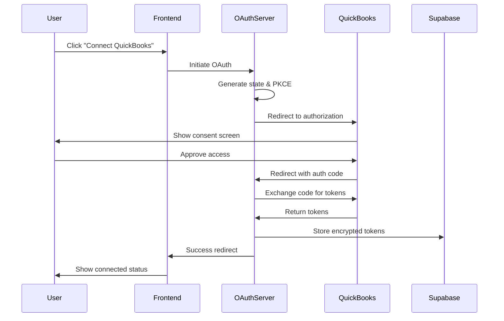

# ADR-0006: Implement OAuth 2.0 for QuickBooks Integration

## Status
Accepted

## Context

### Business Requirements
The QuickBooks Analyzer application requires secure, authorized access to users' QuickBooks Online (QBO) financial data. This integration must:
- Comply with Intuit's security requirements
- Provide seamless user experience for CPAs
- Support multiple QBO company connections per user
- Handle token refresh automatically
- Maintain audit trail for compliance

### Technical Constraints
- Must use Intuit's OAuth 2.0 implementation
- Requires secure token storage
- Need to handle token expiration (access token: 1 hour, refresh token: 100 days)
- Must implement PKCE for enhanced security
- Requires proper state validation to prevent CSRF attacks

## Decision

We will implement OAuth 2.0 authorization code flow with PKCE for QuickBooks Online integration, using a dedicated Express.js server for OAuth handling and Supabase for secure token storage.

### Implementation Architecture

```typescript
// OAuth Flow Implementation
const oauthConfig = {
  clientId: process.env.QBO_CLIENT_ID,
  clientSecret: process.env.QBO_CLIENT_SECRET,
  redirectUri: process.env.QBO_REDIRECT_URI,
  environment: process.env.QBO_ENVIRONMENT, // sandbox or production
  scopes: [
    'com.intuit.quickbooks.accounting',
    'com.intuit.quickbooks.payment',
    'openid',
    'profile',
    'email'
  ]
};
```

### Token Storage Schema

```sql
-- Secure token storage in Supabase
CREATE TABLE qbo_connections (
  id UUID PRIMARY KEY DEFAULT gen_random_uuid(),
  user_id UUID REFERENCES auth.users(id) ON DELETE CASCADE,
  company_id VARCHAR(255) NOT NULL,
  company_name VARCHAR(255),
  access_token TEXT, -- Encrypted
  refresh_token TEXT, -- Encrypted
  token_expiry TIMESTAMP WITH TIME ZONE,
  refresh_token_expiry TIMESTAMP WITH TIME ZONE,
  is_active BOOLEAN DEFAULT true,
  created_at TIMESTAMP WITH TIME ZONE DEFAULT now(),
  updated_at TIMESTAMP WITH TIME ZONE DEFAULT now()
);

-- Enable RLS
ALTER TABLE qbo_connections ENABLE ROW LEVEL SECURITY;

-- User can only access their own connections
CREATE POLICY "Users can manage own QBO connections"
  ON qbo_connections
  FOR ALL
  USING (auth.uid() = user_id);
```

## Alternatives Considered

### 1. Direct API Key Authentication
- **Pros**: Simpler implementation
- **Cons**: Not supported by QuickBooks Online; security concerns
- **Rejected**: QBO requires OAuth 2.0

### 2. OAuth 1.0a (Legacy)
- **Pros**: Was previously supported
- **Cons**: Deprecated by Intuit; complex signature generation
- **Rejected**: No longer supported

### 3. Third-party Integration Services (Zapier, Make)
- **Pros**: No OAuth implementation needed
- **Cons**: Additional cost; limited control; data privacy concerns
- **Rejected**: Need direct integration for real-time analysis

### 4. QuickBooks SDK/Libraries
- **Pros**: Abstracted OAuth handling
- **Cons**: Limited to specific languages; potential vendor lock-in
- **Chosen Partially**: Using Intuit OAuth2.0 Node.js library for token management

## Rationale

### Why OAuth 2.0 with PKCE?
1. **Industry Standard**: Modern, secure authorization protocol
2. **Required by Intuit**: Only supported method for QBO API access
3. **Enhanced Security**: PKCE prevents authorization code interception
4. **User Control**: Users explicitly grant permissions
5. **Token Refresh**: Automatic token renewal without user intervention

### Why Dedicated OAuth Server?
1. **Security Isolation**: Keeps client secret on server-side
2. **Token Management**: Centralized refresh logic
3. **Rate Limiting**: Better control over API requests
4. **Audit Logging**: Server-side tracking of all OAuth events

## Consequences

### Positive
- ✅ Secure access to QBO data without storing user credentials
- ✅ Automatic token refresh maintains continuous access
- ✅ Support for multiple QBO companies per user
- ✅ Compliance with Intuit's security requirements
- ✅ Clear audit trail for regulatory compliance
- ✅ User can revoke access anytime from QBO settings

### Negative
- ❌ Complex initial setup with multiple redirect flows
- ❌ Requires separate OAuth server infrastructure
- ❌ Token refresh complexity (100-day refresh token expiry)
- ❌ Potential for token expiration if not used regularly
- ❌ Additional error handling for OAuth failures

## Implementation Details

### OAuth Flow Sequence



### Token Refresh Strategy

```typescript
class TokenRefreshService {
  async refreshIfNeeded(connectionId: string): Promise<void> {
    const connection = await this.getConnection(connectionId);
    const now = new Date();
    const tokenExpiry = new Date(connection.token_expiry);
    const bufferTime = 5 * 60 * 1000; // 5 minutes buffer
    
    if (now.getTime() > tokenExpiry.getTime() - bufferTime) {
      const newTokens = await this.refreshTokens(connection.refresh_token);
      await this.updateTokens(connectionId, newTokens);
    }
  }
}
```

### Error Handling

```typescript
enum OAuthError {
  INVALID_GRANT = 'invalid_grant',
  ACCESS_DENIED = 'access_denied',
  UNAUTHORIZED_CLIENT = 'unauthorized_client',
  INVALID_SCOPE = 'invalid_scope',
  SERVER_ERROR = 'server_error'
}

function handleOAuthError(error: string): void {
  switch(error) {
    case OAuthError.INVALID_GRANT:
      // Refresh token expired, need re-authorization
      break;
    case OAuthError.ACCESS_DENIED:
      // User denied access
      break;
    // ... handle other cases
  }
}
```

## Security Considerations

1. **Token Encryption**: All tokens encrypted at rest using AES-256
2. **HTTPS Only**: All OAuth redirects over HTTPS
3. **State Validation**: Prevent CSRF with cryptographic state parameter
4. **PKCE Implementation**: Additional code challenge/verifier
5. **Secure Storage**: Tokens never exposed to frontend
6. **Audit Logging**: All OAuth events logged for compliance

## Monitoring and Maintenance

- Monitor token refresh failures
- Alert on approaching refresh token expiry (< 7 days)
- Track OAuth flow completion rates
- Log all authorization events
- Regular security audits of token storage

## Related ADRs

- [ADR-0002](0002-choose-supabase-database.md): Token storage in Supabase
- [ADR-0003](0003-implement-clerk-authentication.md): User authentication before OAuth
- [ADR-0009](0009-implement-row-level-security.md): RLS for token access control

## References

- [Intuit OAuth 2.0 Documentation](https://developer.intuit.com/app/developer/qbo/docs/develop/authentication-and-authorization/oauth-2.0)
- [OAuth 2.0 Security Best Practices](https://datatracker.ietf.org/doc/html/draft-ietf-oauth-security-topics)
- [PKCE RFC 7636](https://datatracker.ietf.org/doc/html/rfc7636)